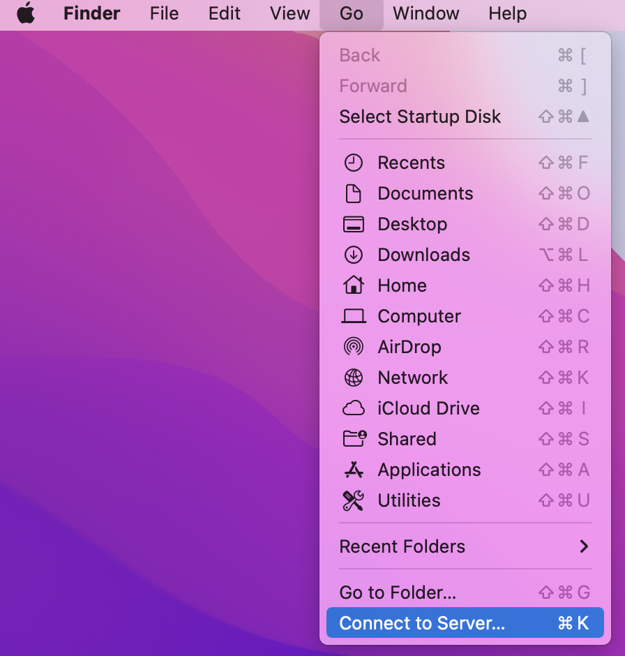

# File Storage on the CSSM Server

A number of CSAFE projects, such as firearms and handwriting, store project data on the Center for Survey Statistics & Methodology (CSSM) server. 

Add discussion of folder privileges and their impact on storing IRB data on the server

**Windows**

1. If you are off campus, log-in to the ISU VPN
1. Open file explorer
1. Type `\\las-dfs-01.las.iastate.edu\lss` in the top textbox
1. Enter your ISU net-id and password
1. Open the research folder
1. Open folder for your CSAFE project

**Mac**

1. If you are off campus, log-in to the ISU VPN
1. Select Go > Connect to Server  
 
  {#id .class width=50% height=50%}

1. Type `smb://las-dfs-01.las.iastate.edu` in the text box. Click the + sign if you would like your computer to remember the server
1. Click Connect
1. Enter your net-id and password
1. Open the LSS folder
1. Open the research folder
1. Open folder for your CSAFE project

