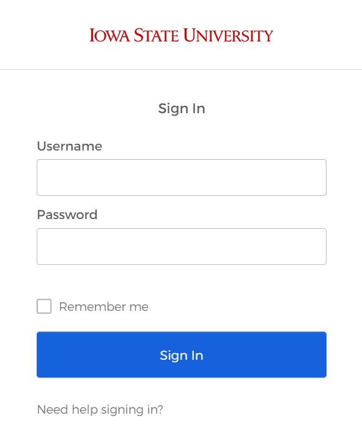
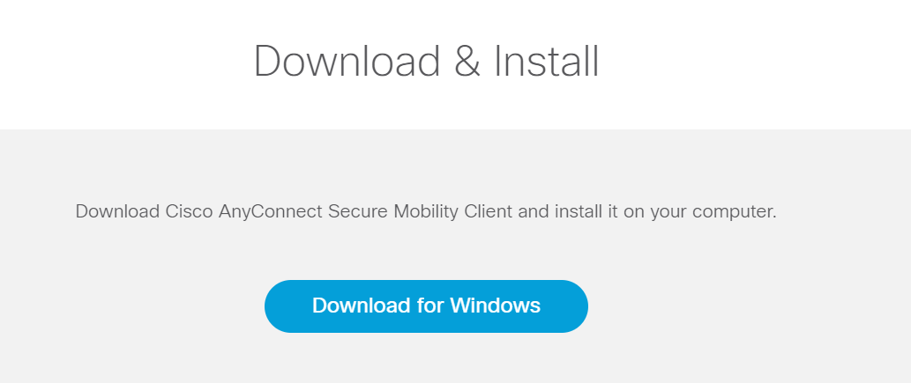

# Getting Started
If you are working from off campus you need to use ISU's virtual private network (VPN) to connect to any of the computing resources covered in this guide. You also need to set up SSH keys. Section \ref@(off-campus) explains how to install and use the ISU VPN and SSH keys. If you will only be working on campus, you may skip this section.

This chapter also includes a Quick Start Guide (Section \ref@(quick-start)) for people who are already comfortable with virtual private networks and command line prompts. 

The last section in this chapter explains how people are granted access to the computing resources covered in this guide.

## Quick Start Guide {#quick-start}
 
### Connect to Large Scale Storage 
1. If you are an undergraduate student, use your CSAFE email net-id and password in the following steps. 
1. If you are off campus, download the ISU virtual private from https://vpn.iastate.edu and log-in using your ISU net-id and password.
1. On **Windows** open File Explorer and in the top textbox type
    - `\\las.iastate.edu\research` if you are **on campus** or
    - `\\las-dfs-01.las.iastate.edu\lss` if you are **off campus**. 
1. On **Mac** click Go > Connect to Server and type
    - `smb://iastate/lss/research` if you are **on campus** or
    - `smb://las-dfs-01.las.iastate.edu` if you are **off campus**.
1. Enter your net-id and password.
1. Open the research folder and go to your CSAFE project folder.

### Connect to CSAFE Rstudio Server
1. If you are an undergraduate student, use your CSAFE email net-id and password in the following steps. 
1. If you are off campus, download the ISU virtual private from https://vpn.iastate.edu and log-in using your ISU net-id and password.
1. Go to the website https://reiss.csafe.iastate.edu/ or https://locard.csafe.iastate.edu/.
1. Enter your net-id and password.

### Connect to the Pronto Job Scheduler
1. If you are an undergraduate student, use your CSAFE email net-id and password in the following steps. 
1. If you are off campus, download the ISU virtual private from https://vpn.iastate.edu and log-in using your ISU net-id and password.
1. On **Windows** open the PowerShell. On **Mac** open the Terminal.
1. Type `ssh your-netid@pronto.las.iastate.edu`
1. Enter your net-id and password.

## Working Off Campus {#off-campus}
If you are on campus, you may skip this section. If you are off campus, you will need to

1. Download and sign in to a virtual private network (see \@ref(install-vpn))
1. Generate SSH keys (see \@ref(ssh-keys))

### Install the ISU Virtual Private Network (VPN) {#install-vpn}
Iowa State University uses Cisco AnyConnect as their virtual private network (VPN) software. You will need to install it on your computer.

1.	Go to https://vpn.iastate.edu
1.	Select Primary as the GROUP and click Login
 
 
  {#id .class width=50% height=50%}

1.	Sign in with your ISU net-id and password
 
 
  {#id .class width=30% height=30%}

1. The site should detect your computer's operating system and give you the option to download the VPN for your operating system.  
 
  {#id .class width=50% height=50%}

1.	Click Download
### Sign In to the ISU VPN {#signin-vpn}

1.	Open Cisco AnyConnect
1.	Type `vpn.iastate.edu` and click Connect
 
 
  {#id .class width=50% height=50%}

1.	Sign in with your ISU net-id and password
 
 
  {#id .class width=30% height=30%}

### Generate SSH keys {#ssh-keys}
ResearchIT gives instructions for setting up SSH keys at https://researchit.las.iastate.edu/how-generate-ssh-keys. Setting up my SSH keys took lots of trial and error. If you run into problems or get stuck, email researchit@iastate.edu.
