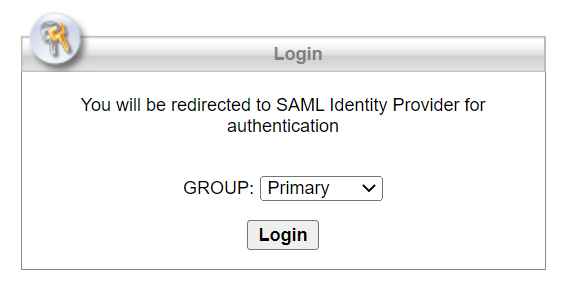
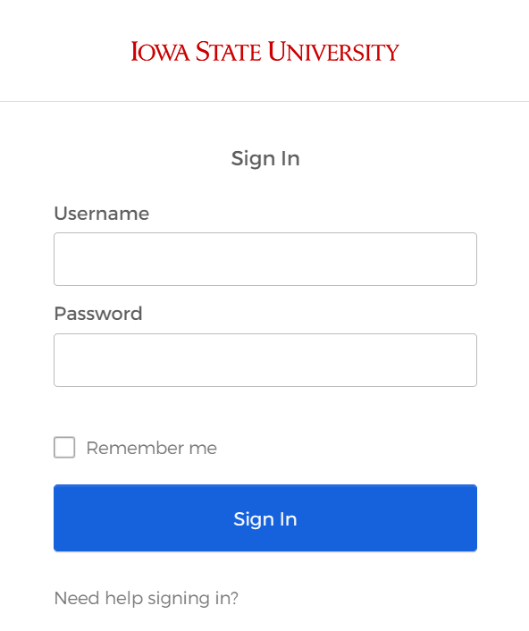
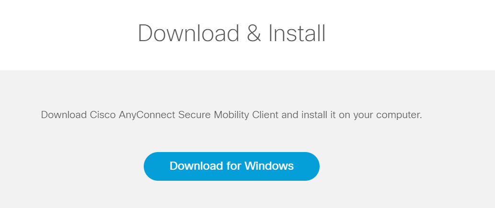
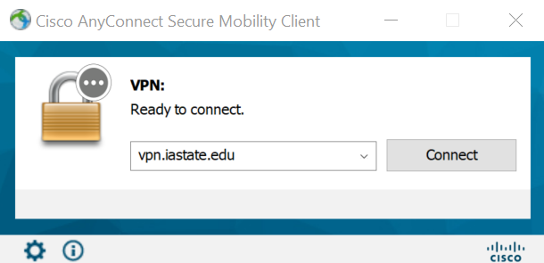

# Getting Started

## Getting Access
The Center for Survey Statistics & Methodology (CSSM) manages access to the Large Scale Storage (LSS) and the CSAFE RStudio Servers. Each CSAFE project has a list of people that work on that project. CSSM grants everyone on a project's list access to that project's folder on LSS. If you are unable to connect to LSS or the CSAFE RStudio Servers, contact Kristen Hanson at khanson3 at iastate dot edu. She will make sure that you are on the appropriate CSAFE project list.

## Working Off Campus
If you are on campus, you may skip this chapter. If you are off campus, you will need to

1. Download and sign in to a virtual private network (see \@ref(install-vpn))
1. Generate SSH keys (see \@ref(ssh-keys))

### Install the ISU Virtual Private Network (VPN) {#install-vpn}
Iowa State University uses Cisco AnyConnect as their virtual private network (VPN) software. You will need to install it on your computer.

1.	Go to https://vpn.iastate.edu
1.	Select Primary as the GROUP and click Login
 
 
  {#id .class width=50% height=50%}

1.	Sign in with your ISU net-id and password
 
 
  {#id .class width=30% height=30%}

1. The site should detect your computer's operating system and give you the option to download the VPN for your operating system.  
 
  {#id .class width=50% height=50%}

1.	Click Download
### Sign In to the ISU VPN {#signin-vpn}

1.	Open Cisco AnyConnect
1.	Type `vpn.iastate.edu` and click Connect
 
 
  {#id .class width=50% height=50%}

1.	Sign in with your ISU net-id and password
 
 
  {#id .class width=30% height=30%}

### Generate SSH keys {#ssh-keys}
ResearchIT gives instructions for setting up SSH keys at https://researchit.las.iastate.edu/how-generate-ssh-keys. Setting up my SSH keys took lots of trial and error. If you run into problems or get stuck, email researchit@iastate.edu.
