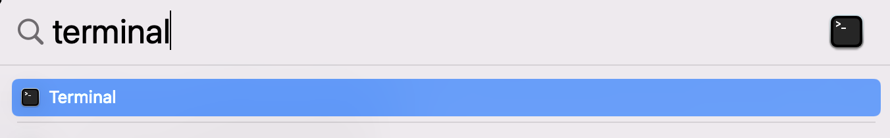

# Pronto

## Connecting to the Pronto job scheduler {#pronto}

You connect to the pronto job scheduler through the PowerShell on Windows or the Terminal on Mac.

**Windows**

1. Type `powershell` in the Windows Search Bar next to the Start Menu 
<br><div style="margin-bottom:10px; margin-top:10px"> 
  {#id .class width=50% height=50%}
</div>
1. Click Windows PowerShell in the list to open the PowerShell
<br><div style="margin-bottom:10px; margin-top:10px"> 
  {#id .class width=50% height=50%}
</div>
1. Type `ssh your_netid@pronto.las.iastate.edu`
<br><div style="margin-bottom:10px; margin-top:10px"> 
  {#id .class width=50% height=50%}
</div>
1. Type your net-id password
1. You should now see 
    ```{bash pronto prompt, eval=FALSE}
    [your_netid@pronto ~]$
    ```

**Mac**

1. Do a spotlight search by clicking on the magnifying glass in the upper right corner of the screen <br><div style="margin-bottom:10px; margin-top:10px"> 
  {#id .class width=50% height=50%}
</div>
1. Type `terminal` and click Terminal in the list <br><div style="margin-bottom:10px; margin-top:10px"> 
  {#id .class width=50% height=50%}
</div>
1. In the Terminal widow, type `ssh your_netid@pronto.las.iastate.edu` <br><div style="margin-bottom:10px; margin-top:10px"> 
  {#id .class width=50% height=50%}
</div>
1. Type your net-id password

## Connecting to the Pronto data transfer node {#prontodtn}
You need to transfer your data to Pronto using the Pronto data transfer node (ProntoDTN). CSAFE has a folder for CSAFE users on ProntoDTN. The file path is `prontodtn.las.iastate.edu > work > LAS > csafe-lab`. Create a folder for yourself in the csafe-lab folder. Most users use their net-id as the folder name, but I think you can name it anything you want. 

The work directory is not backed-up so don't use this folder for long term storage.

Each user also has a home folder. These folders have limited storage so researchIT recommends only placing small files in the home folder. I find it easier to store everything in my work folder and not use my home folder at all.

**Windows**

1. Open file explorer
1. Type `\\prontodtn.las.iastate.edu` in the top textbox <br><div style="margin-bottom:10px; margin-top:10px"> 
  {#id .class width=50% height=50%}
</div>
1. Open the work folder
1. Open the LAS folder
1. Open the csafe-lab folder
1. Create a new folder with your net-id as the name

**Mac**

1. Select Go > Connect to Server <br><div style="margin-bottom:10px; margin-top:10px"> 
  {#id .class width=50% height=50%}
</div>
1. Type `smb://prontodtn.las.iastate.edu` in the text box. Click the + sign if you would like your computer to remember the server.  <br><div style="margin-bottom:10px; margin-top:10px"> 
  {#id .class width=50% height=50%}
</div>
1. Click Connect
1. Enter your net-id and password
1. Select Work and click OK.
1. Open the LAS folder
1. Open the csafe-lab folder
1. Create a new folder with your net-id as the name

### Transfering large amounts of data using Globus

If you have large amounts of data to transfer, researchIT recommends that you use Globus Connect Personal. Go to https://researchit.las.iastate.edu/how-transfer-files-pronto-globus to download Globus.

Instructions for transferring data with Globus are here:  https://docs.globus.org/how-to/get-started/.


## Running an R script on Pronto
There are two ways to run a script on Pronto:

1. in an interactive session
1. as a batch job

If I understand correctly, an interactive session is intended for troubleshooting your code. ResearchIT says, "Once you've got your program running in an interactive session please switch to an sbatch script if possible." [https://researchit.las.iastate.edu/pronto?msclkid=3263c889c17811ec81e13068586d8872]

Pronto uses the Simple Linux Utility for Resource Management (Slurm) to allocate resources (computer nodes and clusters) to users [https://en.wikipedia.org/wiki/Slurm_Workload_Manager]. In order to run your script as a batch job, you need to write a Slurm file that includes information about your job and the resources your would like to request.

## Interactive Sessions
### Example: Start an interactive session {#ex-start-interactive}
1. If you are off campus, connect to the ISU VPN (see \@ref(signin-vpn)) 
1. Sign-in to Pronto (see \@ref(pronto)).
1. In the Pronto terminal, type
    ```{bash interative, eval=FALSE}
    $ srun --nodes 1 --tasks 4 --partition interactive --time 01:00:00 --pty bash
    ```
This starts an interactive session.
1. Load the module for R version 4.0.4. This version of R requires that a specific version of gcc be loaded first.
    ```{bash load r, eval=FALSE}
    $ module load gcc/10.2.0-zuvaafu
    $ module load r/4.0.4-py3-4khjixy
    ```
1. Tell Pronto to install R packages in your csafe-lab work folder. (This is considered the best practice by ResearchIT https://researchit.las.iastate.edu/how-run-r-pronto?msclkid=865a487bc65e11ecbfd7e59a7ab1dc47.)
    ```{bash install packages, eval=FALSE}
    $ export R_LIBS_USER=/work/LAS/your-lab/yournetid/Rlibs
    $ mkdir -p $R_LIBS_USER
    ```
1. Start the R interpreter
    ```{bash start r, eval=FALSE}
    $ R
    ```

### Example: Install dplyr package {#ex-interactive-install}
1. Start an interactive R session (see \@ref(ex-start-interactive))
1. 
    ```{bash install dplyr, eval=FALSE}
    > install.packages("dplyr",lib="/work/LAS/csafe-lab/your_netid/Rlibs", repos="https://mirror.las.iastate.edu/CRAN")
    ```

## Batch Jobs
### Example: A basic R script {#ex-basic}

1. If you are off campus, connect to the ISU VPN (see \@ref(signin-vpn)) 
1. Sign-in to Pronto (see \@ref(pronto)).
1. Open your csafe-lab work folder `prontodtn.las.iastate.edu > work > LAS > csafe-lab > your_netid` (see \@ref(prontodtn))
1. Create a new R script with the following lines of code:
    ```{r basic script, eval=FALSE}
    a = 5
    print(a)
    ```
Save the script as `basic.R`. Copy the script to your csafe-lab work folder.
1. Create a text file for Slurm with the following text:
    ```{bash slurm for basic script, eval=FALSE}
    #!/bin/bash

    #SBATCH --nodes=1 # request one node
    #SBATCH --cpus-per-task=1  # ask for 1 cpu
    #SBATCH --mem=1G #  asks for 1 GB of RAM
    #SBATCH --time=00:30:02 # ask that the job be allowed to run for 30 minutes and 2 seconds.

    # everything below this line is optional
    #SBATCH --output=/work/LAS/csafe-lab/your_netid/job_%J_out.txt # store console output
    #SBATCH --error=/work/LAS/csafe-lab/your_netid/job_%J_err.txt # store error messages

    module load r
    cd /work/LAS/csafe-lab/your_netid
    R --save < basic.R
    ```
Save the file as `basic.txt`.
1. (Windows Only) If you are using Windows, your text file will likely have DOS line breaks instead of UNIX line breaks which will cause an error when the file is run on Pronto. Open Terminal in RStudio, use `cd folder/containing/text_file` to change directories to the folder containing your text file, and type `dos2unix basic.txt` to change the line breaks to UNIX format.
1. Copy the text file to your csafe-lab work folder.
1. In the command line prompt where you are connected to Pronto, type 
    ```{bash run basic script, eval=FALSE}
    $ sbatch /work/LAS/csafe-lab/your_netid/basic.txt
    ```` 
    This will add your job to the queue. The script is so short, your job will probably run immediately.
1. Two new files -- `job_<job#>_err.txt` and `job_<job#>_out.txt` -- should appear in your csafe-lab work folder. If `basic.R` ran successfully, the `job_<job#>_out` file should contain
    ```{bash basic script output, eval=FALSE}
> a = 5
> print(a)
[1] 5
> 
    ```
and `job_<job#>_err.txt` should be blank. If the error file isn't blank, troubleshoot the error(s). If you get stuck, email researchit@iastate.edu.

### Example: Save a dataframe to a CSV file {#ex-save}
In this example, I will show you how to save a dataframe to a csv file.

1. If you are off campus, connect to the ISU VPN (see \@ref(signin-vpn)) 
1. Sign-in to Pronto (see \@ref(pronto)).
1. Open your csafe-lab work folder `prontodtn.las.iastate.edu > work > LAS > csafe-lab > your_netid` (see \@ref(prontodtn))
1. Create a new R script with the following lines of code:
    ```{r save script, eval=FALSE}
    # draw 10 samples from normal distribution
    data = rnorm(10)
    
    # put in a dataframe
    df = data.frame(x=data)
    
    # save dataframe
    write.csv(df, "data.csv")
    ```
Save the script as `dataframe.R`. Copy the script to your csafe-lab work folder.
1. Create a text file for Slurm with the following text:
    ```{bash slurm for save script, eval=FALSE}
    #!/bin/bash

    #SBATCH --nodes=1 # request one node
    #SBATCH --cpus-per-task=1  # ask for 1 cpu
    #SBATCH --mem=1G #  asks for 1 GB of RAM
    #SBATCH --time=00:30:02 # ask that the job be allowed to run for 30 minutes and 2 seconds.

    # everything below this line is optional
    #SBATCH --output=/work/LAS/csafe-lab/your_netid/job_%J_out.txt # store console output
    #SBATCH --error=/work/LAS/csafe-lab/your_netid/job_%J_err.txt # store error messages

    module load r
    cd /work/LAS/csafe-lab/your_netid
    R --save < dataframe.R
    ```
Save the file as `dataframe.txt`.
1. (Windows Only) If you are using Windows, your text file will likely have DOS line breaks instead of UNIX line breaks which will cause an error when the file is run on Pronto. Open Terminal in RStudio, use `cd folder/containing/text_file` to change directories to the folder containing your text file, and type `dos2unix dataframe.txt` to change the line breaks to UNIX format.
1. Copy the text file to your csafe-lab work folder.
1. In the command line prompt where you are connected to Pronto, type
    ```{bash run save script, eval=FALSE}
    $ sbatch /work/LAS/csafe-lab/your_netid/dataframe.txt
    ```` 
    This will add your job to the queue. The script is so short, your job will probably run immediately.
1. The dataframe should be saved in a file `data.csv` in your csafe-lab work folder. There should be two other new files -- `data.csv`, `job_<job#>_err.txt` and `job_<job#>_out.txt` -- in your csafe-lab work folder as well. If the error file isn't blank, troubleshoot the error(s). If you get stuck, email researchit@iastate.edu.

### Example: Load data from a CSV file {#ex-load}
In this example, we will load the csv file `data.csv` that we saved in Example \@ref(ex-save).

1. If you are off campus, connect to the ISU VPN (see \@ref(signin-vpn)) 
1. Sign-in to Pronto (see \@ref(pronto)).
1. Open your csafe-lab work folder `prontodtn.las.iastate.edu > work > LAS > csafe-lab > your_netid` (see \@ref(prontodtn))
1. Double-check that the file `data.csv` is still in your csafe-lab work folder. If you deleted it, follow the steps in example \@ref(ex-save) to recreate it.
1. Create a new R script with the following lines of code:
    ```{r load script, eval=FALSE}
    df = read.csv("data.csv")
    head(df)
    ```
Save the script as `load.R` and copy it to you csafe-lab work folder.
1. Create a text file for Slurm with the following text:
    ```{bash slurm for load script, eval=FALSE}
    #!/bin/bash

    #SBATCH --nodes=1 # request one node
    #SBATCH --cpus-per-task=1  # ask for 1 cpu
    #SBATCH --mem=1G #  asks for 1 GB of RAM
    #SBATCH --time=00:30:02 # ask that the job be allowed to run for 30 minutes and 2 seconds.

    # everything below this line is optional
    #SBATCH --output=/work/LAS/csafe-lab/your_netid/job_%J_out.txt # store console output
    #SBATCH --error=/work/LAS/csafe-lab/your_netid/job_%J_err.txt # store error messages

    module load r
    cd /work/LAS/csafe-lab/your_netid
    R --save < load.R
    ```
Save the file as `load.txt`.
1. (Windows Only) If you are using Windows, your text file will likely have DOS line breaks instead of UNIX line breaks which will cause an error when the file is run on Pronto. Open Terminal in RStudio, use `cd folder/containing/text_file` to change directories to the folder containing your text file, and type `dos2unix load.txt` to change the line breaks to UNIX format.
1. Copy the text file to your csafe-lab work folder.
1. In the command line prompt where you are connected to Pronto, type
    ```{bash run load script, eval=FALSE}
    $ sbatch /work/LAS/csafe-lab/your_netid/load.txt
    ```` 
    This will add your job to the queue. The script is so short, your job will probably run immediately.
1. Open the file `job_<job#>_out.txt` in your csafe-lab work folder and make sure that the first six lines of the dataframe were printed.

### Example: Install R packages {#ex-batch-install}
Just like in Rstudio on your local machine, you will need to install any R packages that you want use. In this example, we will install futile.logger, doParallel, doRNG, and tidyverse so that we can use these packages in future examples.

1. If you are off campus, connect to the ISU VPN (see \@ref(signin-vpn)) 
1. Sign-in to Pronto (see \@ref(pronto)).
1. Open your csafe-lab work folder `prontodtn.las.iastate.edu > work > LAS > csafe-lab > your_netid` (see \@ref(prontodtn))
1. Create a new R script with the following lines of code:
    ```{r batch script to install packages, eval=FALSE}
    install.packages(c("futile.logger", 
                       "doParallel", 
                       "doRNG",
                       "tidyverse"), 
                       lib="/work/LAS/csafe-lab/your_netid/Rlibs", 
                       repos="https://mirror.las.iastate.edu/CRAN")
    ```
The line starting with `lib=` tells Pronto to install the R packages in your csafe-lab work folder. The line starting with `repos=` tells Pronto which CRAN mirror to use. ResearchIT says that these two lines should always be used [https://researchit.las.iastate.edu/how-run-r-pronto]. Save the script as `install_packages.R`. Copy the script to your csafe-lab work folder.
1. Create a text file for Slurm with the following text:
    ```{bash slurm script to install packages, eval=FALSE}
    #!/bin/bash

#SBATCH --nodes=1 # request one node
#SBATCH --cpus-per-task=1  # ask for 1 cpu
#SBATCH --mem=1G #  asks for 1 GB of RAM
#SBATCH --time=00:30:02 # ask that the job be allowed to run for 30 minutes and 2 seconds.

# everything below this line is optional
#SBATCH --output=/work/LAS/csafe-lab/your_netid/job_%J_out.txt # store console output
#SBATCH --error=/work/LAS/csafe-lab/your_netid/job_%J_err.txt # store error messages

export R_LIBS_USER=/work/LAS/csafe-lab/your_netid/Rlibs
mkdir -p $R_LIBS_USER

module load r
cd /work/LAS/csafe-lab/your_netid
R --save < install_packages.R
    ```
Save the file as `install_packages.txt`.
1. (Windows Only) If you are using Windows, your text file will likely have DOS line breaks instead of UNIX line breaks which will cause an error when the file is run on Pronto. Open Terminal in RStudio, use `cd folder/containing/text_file` to change directories to the folder containing your text file, and type `dos2unix install_packages.txt` to change the line breaks to UNIX format.
1. Copy the text file to your csafe-lab work folder.
1. In the command line prompt where you are connected to Pronto, type
    ```{bash run install packages, eval=FALSE}
    $ sbatch /work/LAS/csafe-lab/your_netid/install_packages.txt
    ```` 
    This will add your job to the queue. Just like on your local machine, it might take several minutes to install the packages.
1. There should be two other new files -- `data.csv`, `job_<job#>_err.txt` and `job_<job#>_out.txt` -- in your csafe-lab work folder. 


### Example: Run code in parallel {#ex-parallel}
The main benefit of Pronto is that it can run code in parallel. In this example, I will show you how to run a for loop in parallel using the doParallel library. R has other packages for parallel computing, but ResearchIT uses doParallel in their how-to [https://researchit.las.iastate.edu/how-run-r-pronto] so that's what I will use here.

If you completed Example \@ref(ex-batch-install) the doParallel package will already be installed. If you need to install the doParallel package see Examples \@ref(ex-interactive-install) or \@ref(ex-batch-install) for instructions.

1. If you are off campus, connect to the ISU VPN (see \@ref(signin-vpn)) 
1. Sign-in to Pronto (see \@ref(pronto)).
1. Open your csafe-lab work folder `prontodtn.las.iastate.edu > work > LAS > csafe-lab > your_netid` (see \@ref(prontodtn))
1. Create a new R script with the following lines of code:
    ```{r parallel script, eval=FALSE}
library(doParallel)

nCores = as.integer(Sys.getenv("SLURM_CPUS_PER_TASK"))
myCluster = parallel::makeCluster(nCores)
doParallel::registerDoParallel(myCluster)

results = foreach(i=1:10) %dopar% {
  rnorm(1000)}
saveRDS(results, "parallel_results.rds")
    ```
Save the script as `parallel.R`. Copy the script to your csafe-lab work folder.
1. Create a text file for Slurm with the following text:
    ```{bash slurm for parallel script, eval=FALSE}
    #!/bin/bash

#SBATCH --nodes=1 # request one node
#SBATCH --cpus-per-task=10  # ask for 10 cpu
#SBATCH --mem=1G #  asks for 1 GB of RAM
#SBATCH --time=00:30:02 # ask that the job be allowed to run for 30 minutes and 2 seconds.

# everything below this line is optional
#SBATCH --output=/work/LAS/csafe-lab/your_netid/job_%J_out.txt # store console output
#SBATCH --error=/work/LAS/csafe-lab/your_netid/job_%J_err.txt # store error messages

export R_LIBS_USER=/work/LAS/csafe-lab/your_netid/Rlibs

module load r
cd /work/LAS/csafe-lab/your_netid
R --save < parallel.R
    ```
Save the file as `parallel.txt`.
1. (Windows Only) If you are using Windows, your text file will likely have DOS line breaks instead of UNIX line breaks which will cause an error when the file is run on Pronto. Open Terminal in RStudio, use `cd folder/containing/text_file` to change directories to the folder containing your text file, and type `dos2unix parallel.txt` to change the line breaks to UNIX format.
1. Copy the text file to your csafe-lab work folder.
1. In the command line prompt where you are connected to Pronto, type
    ```{bash run parallel script, eval=FALSE}
    $ sbatch /work/LAS/csafe-lab/your_netid/parallel.txt
    ```` 
1. The results of the parallel loop should be saved in `parallel.txt` in your csafe-lab work folder.

### Example: Set the seed for the random number generator {#ex-seed}
If you run Example \@ref(ex-parallel) multiple times, the numbers sampled from the normal distribution will likely be different each time. If you want to make the sample reproducible
(produce the same sample each time), set the seed for the random number generator. The most common way to set a seed is with the `set.seed()` function. This function does not work with `%dopar%` from the doParallel package, but it does work with `%dorng%`.

1. If you are off campus, connect to the ISU VPN (see \@ref(signin-vpn)) 
1. Sign-in to Pronto (see \@ref(pronto)).
1. Open your csafe-lab work folder `prontodtn.las.iastate.edu > work > LAS > csafe-lab > your_netid` (see \@ref(prontodtn))
1. Create a new R script with the following lines of code:
    ```{r seed script, eval=FALSE}
library(doParallel)
library(doRNG)

nCores = as.integer(Sys.getenv("SLURM_CPUS_PER_TASK"))
myCluster = parallel::makeCluster(nCores)
doParallel::registerDoParallel(myCluster)

starting_seed = 300

set.seed(starting_seed)
r1 = foreach(i=1:4) %dorng%{ runif(1) }

set.seed(starting_seed)
r2 = foreach(i=1:4) %dorng%{ runif(1) }
identical(r1, r2)
    ```
Save the script as `seed.R`. Copy the script to your csafe-lab work folder.
1. Create a text file for Slurm with the following text:
    ```{bash slurm for seed script, eval=FALSE}
#!/bin/bash

#SBATCH --nodes=1 # request one node
#SBATCH --cpus-per-task=10  # ask for 10 cpu
#SBATCH --mem=1G #  asks for 1 GB of RAM
#SBATCH --time=00:30:02 # ask that the job be allowed to run for 30 minutes and 2 seconds.

# everything below this line is optional
#SBATCH --output=/work/LAS/csafe-lab/your_netid/job_%J_out.txt # store console output
#SBATCH --error=/work/LAS/csafe-lab/your_netid/job_%J_err.txt # store error messages

export R_LIBS_USER=/work/LAS/csafe-lab/your_netid/Rlibs

module load r
cd /work/LAS/csafe-lab/your_netid
R --save < seed.R
    ```
Save the file as `seed.txt`.
1. (Windows Only) If you are using Windows, your text file will likely have DOS line breaks instead of UNIX line breaks which will cause an error when the file is run on Pronto. Open Terminal in RStudio, use `cd folder/containing/text_file` to change directories to the folder containing your text file, and type `dos2unix seed.txt` to change the line breaks to UNIX format.
1. Copy the text file to your csafe-lab work folder.
1. In the command line prompt where you are connected to Pronto, type
    ```{bash run seed script, eval=FALSE}
    $ sbatch /work/LAS/csafe-lab/your_netid/seed.txt
    ```` 
1. Open the `job_<job#>_out.txt` file to make sure that the result of `identical(r1, r2)` is `TRUE`.

### Example: Use functions from dplyr and magrittr in parallel {#ex-packages-parallel}
The previous parallel examples used the base R functions `rnorm` and `runif`. If we want to use
functions from packages that we install, we need to pass the package names to the `%dorng%` operator. We will learn how to do this in this example.

If you haven't already installed the `tidyverse` package, follow the steps in Example 4 to install the `tidyverse` or install `dplyr` and `magrittr` separately.

1. If you are off campus, connect to the ISU VPN (see \@ref(signin-vpn)) 
1. Sign-in to Pronto (see \@ref(pronto)).
1. Open your csafe-lab work folder `prontodtn.las.iastate.edu > work > LAS > csafe-lab > your_netid` (see \@ref(prontodtn))
1. Create a new R script with the following lines of code:
    ```{r packages in parallel script, eval=FALSE}
library(doParallel)
library(doRNG)
library(magrittr)
library(dplyr)

nCores = as.integer(Sys.getenv("SLURM_CPUS_PER_TASK"))
myCluster = parallel::makeCluster(nCores)
doParallel::registerDoParallel(myCluster)

set.seed(100)
r1 = foreach(i=1:10, .packages=c("dplyr", "magrittr")) %dorng%{ 
  cluster_centers = df %>% slice_sample(n=40)
}

set.seed(100)
r2 = foreach(i=1:10, .packages=c("dplyr", "magrittr")) %dorng%{ 
  cluster_centers = df %>% slice_sample(n=40)
}

set.seed(200)
r3 = foreach(i=1:10, .packages=c("dplyr", "magrittr")) %dorng%{ 
  cluster_centers = df %>% slice_sample(n=40)
}

identical(r1, r2)
identical(r1, r3)
    ```
Save the script as `magrittr.R`. Copy the script to your csafe-lab work folder.
1. Create a text file for Slurm with the following text:
    ```{bash slurm for packages in parallel, eval=FALSE}
#!/bin/bash

#SBATCH --nodes=1 # request one node
#SBATCH --cpus-per-task=10  # ask for 10 cpu
#SBATCH --mem=1G #  asks for 1 GB of RAM
#SBATCH --time=00:30:02 # ask that the job be allowed to run for 30 minutes and 2 seconds.

# everything below this line is optional
#SBATCH --output=/work/LAS/csafe-lab/your_netid/job_%J_out.txt # store console output
#SBATCH --error=/work/LAS/csafe-lab/your_netid/job_%J_err.txt # store error messages

export R_LIBS_USER=/work/LAS/csafe-lab/your_netid/Rlibs

module load r
cd /work/LAS/csafe-lab/your_netid
R --save < magrittr.R
    ```
Save the file as `magrittr.txt`.
1. (Windows Only) If you are using Windows, your text file will likely have DOS line breaks instead of UNIX line breaks which will cause an error when the file is run on Pronto. Open Terminal in RStudio, use `cd folder/containing/text_file` to change directories to the folder containing your text file, and type `dos2unix magrittr.txt` to change the line breaks to UNIX format.
1. Copy the text file to your csafe-lab work folder.
1. In the command line prompt where you are connected to Pronto, type
    ```{bash run packages in parallel, eval=FALSE}
    $ sbatch /work/LAS/csafe-lab/your_netid/magrittr.txt
    ```` 
1. Open the `job_<job#>_out.txt` file to make sure that the result of `identical(r1, r2)` is `TRUE` and `identical(r1, r3)` is `FALSE`.

### Example: Use a user-defined function to save results inside a parallel loop
1. If you are off campus, connect to the ISU VPN (see \@ref(signin-vpn)) 
1. Sign-in to Pronto (see \@ref(pronto)).
1. Open your csafe-lab work folder `prontodtn.las.iastate.edu > work > LAS > csafe-lab > your_netid` (see \@ref(prontodtn))
1. Create a new R script with the following lines of code:
    ```{r function to save in parallel script, eval=FALSE}
library(doParallel)
library(doRNG)
source("parallel_save.R")

nCores = as.integer(Sys.getenv("SLURM_CPUS_PER_TASK"))
myCluster = parallel::makeCluster(nCores)
doParallel::registerDoParallel(myCluster)

starting_seed = 300

set.seed(starting_seed)
r1 = foreach(i=1:10) %dorng% {
  save_sample(n=10000, filename=paste0("sample_",i,".rds")) 
}
    ```
Save the script as `run_parallel_save.R`. Copy the script to your csafe-lab work folder.
1. Create a text file for Slurm with the following text:
    ```{r slurm for function to save in parallel, eval=FALSE}
#!/bin/bash

#SBATCH --nodes=1 # request one node
#SBATCH --cpus-per-task=10
#SBATCH --mem=2G 
#SBATCH --time=00:15:00

# everything below this line is optional
#SBATCH --output=/work/LAS/csafe-lab/your_netid/job_%J_out.txt # store console output
#SBATCH --error=/work/LAS/csafe-lab/your_netid/job_%J_err.txt # store error messages

export R_LIBS_USER=/work/LAS/csafe-lab/your_netid/Rlibs

module load r
cd /work/LAS/csafe-lab/your_netid
R --save < run_parallel_save.R
    ```
Save the file as `parallel_save.txt`.
1. (Windows Only) If you are using Windows, your text file will likely have DOS line breaks instead of UNIX line breaks which will cause an error when the file is run on Pronto. Open Terminal in RStudio, use `cd folder/containing/text_file` to change directories to the folder containing your text file, and type `dos2unix parallel_save.txt` to change the line breaks to UNIX format.
1. Copy the text file to your csafe-lab work folder.
1. In the command line prompt where you are connected to Pronto, type
    ```{bash slurm for run packages in parallel, eval=FALSE}
    $ sbatch /work/LAS/csafe-lab/your_netid/parallel_save.txt
    ```` 
1. There should be ten rds files names sample_1.rds, sample_2.rds, etc. in your csafe-lab folder.

### Example: Create a log file {#ex-log}
In this example we will create a simple log file using the `futile.logger` package. 

1. If you are off campus, connect to the ISU VPN (see \@ref(signin-vpn)) 
1. Sign-in to Pronto (see \@ref(pronto)).
1. Open your csafe-lab work folder `prontodtn.las.iastate.edu > work > LAS > csafe-lab > your_netid` (see \@ref(prontodtn))
1. Create a new R script with the following lines of code:
    ```{r log script, eval=FALSE}
library(futile.logger)

futile.logger::flog.appender(appender.file("log_file.txt"), name='log')
futile.logger::flog.info("start script...", name='log')

a = 5
futile.logger::flog.info("variable a = %d", a, name='log')
    ```
Save the script as `log.R`. Copy the script to your csafe-lab work folder.
1. Create a text file for Slurm with the following text:
    ```{bash slurm for log script, eval=FALSE}
#!/bin/bash

#SBATCH --nodes=1 # request one node
#SBATCH --cpus-per-task=10  # ask for 10 cpu
#SBATCH --mem=1G #  asks for 1 GB of RAM
#SBATCH --time=00:30:02 # ask that the job be allowed to run for 30 minutes and 2 seconds.

# everything below this line is optional
#SBATCH --output=/work/LAS/csafe-lab/your_netid/job_%J_out.txt # store console output
#SBATCH --error=/work/LAS/csafe-lab/your_netid/job_%J_err.txt # store error messages

export R_LIBS_USER=/work/LAS/csafe-lab/your_netid/Rlibs

module load r
cd /work/LAS/csafe-lab/your_netid
R --save < log.R
    ```
Save the file as `log.txt`.
1. (Windows Only) If you are using Windows, your text file will likely have DOS line breaks instead of UNIX line breaks which will cause an error when the file is run on Pronto. Open Terminal in RStudio, use `cd folder/containing/text_file` to change directories to the folder containing your text file, and type `dos2unix log.txt` to change the line breaks to UNIX format.
1. Copy the text file to your csafe-lab work folder.
1. In the command line prompt where you are connected to Pronto, type
    ```{bash run log script, eval=FALSE}
    $ sbatch /work/LAS/csafe-lab/your_netid/log.txt
    ```` 
1. A log file called `log_file.txt` should appear in your csafe-lab work folder. The contents of the log should look like 
    ```{bash log script output, eval=FALSE}
    INFO [2022-05-04 10:42:37] start script...
    INFO [2022-05-04 10:42:37] variable a = 5
    ```` 

## Pronto Commands
### List loaded modules
1. In an interactive session, type
    ```{bash list modules, eval=FALSE}
    $ module list
    ```` 

### Purge all loaded modules
1. In an interactive session, type
    ```{bash purge modules, eval=FALSE}
    $ module purge
    ```` 

### View your job(s) in the Pronto queue
1. In pronto terminal (not in an interactive session), type
    ```{bash queue, eval=FALSE}
    $ squeue -u your-netid
    ```` 

### Cancel a job
1. In pronto terminal (not in an interactive session), type
    ```{bash cancel, eval=FALSE}
    $ scancel jobid
    ```` 
where jobid is the six-digit number for the job you want to cancel. 

## Install the handwriter package
CSAFE created an R package for statistical handwriting analysis called handwriter. The handwriter package requires a number of other R packages, some of which caused errors when I tried to install handwriter in an interactive session on Pronto following the instructions in \@ref(ex-interactive-install). ResearchIT helped me figure out how to install the problem packages and ultimately install handwriter. This section records the step-by-step details of how I was able to install handwriter. My hope is that you will also be able to sucessfully install handwriter if you follow these steps. If you run into problems, email researchit@iastate.edu.

1. If you are off campus, connect to the ISU VPN (see \@ref(signin-vpn)) 
1. Sign-in to Pronto (see \@ref(pronto)).
1. Some of the packages used by handwriter are only available on Pronto for R 4.0.4. Start the R 4.0.4 interpreter in an interactive session on Pronto.
    ```{bash start R, eval=FALSE}
    $ srun --nodes 1 --tasks 4 --partition interactive --time 01:00:00 --pty bash
    $ module purge
    $ module load gcc/10.2.0-zuvaafu
    $ module load r/4.0.4-py3-4khjixy
    $ R
    ```
1. Try to install the handwriter package
    ```{bash handwriter, eval=FALSE}
    > install.packages("handwriter",lib="/work/LAS/csafe-lab/your_netid/Rlibs", repos="https://mirror.las.iastate.edu/CRAN")
    ```
I received error messages stating that the packages igraph, randomForest, and magick could not be installed. I had to install these packages separately.
1. Install igraph
    ```{bash igraph, eval=FALSE}
    > install.packages("igraph",lib="/work/LAS/csafe-lab/your_netid/Rlibs", repos="https://mirror.las.iastate.edu/CRAN")
    ```
1. Then randomForest 
    ```{bash randomForest, eval=FALSE}
    > install.packages("https://cran.r-project.org/src/contrib/Archive/randomForest/randomForest_4.6-14.tar.gz", repos=NULL, type="source",lib="/work/LAS/csafe-lab/your_netid/Rlibs")
    ```
1. Install magick
    ```{bash magick, eval=FALSE}
    > install.packages("magick", 
configure.vars=c("INCLUDE_DIR='. -D_GLIBCXX_USE_CXX11_ABI=0 -fopenmp -DMAGICKCORE_HDRI_ENABLE=1 -DMAGICKCORE_QUANTUM_DEPTH=16 -I/opt/rit/spack-app/linux-rhel7-x86_64/gcc-4.8.5/image-magick-7.0.5-9-6xplmhr3zv6pu2frzsuyof2coe4tuguh/include/ImageMagick-7' LIB_DIR='. -D_GLIBCXX_USE_CXX11_ABI=0 -Wl,-rpath,/opt/rit/spack-app/linux-rhel7-x86_64/gcc-4.8.5/image-magick-7.0.5-9-6xplmhr3zv6pu2frzsuyof2coe4tuguh/lib -L/opt/rit/spack-app/linux-rhel7-x86_64/gcc-4.8.5/image-magick-7.0.5-9-6xplmhr3zv6pu2frzsuyof2coe4tuguh/lib -lMagick++-7.Q16HDRI -lMagickWand-7.Q16HDRI -lMagickCore-7.Q16HDRI #'"),
lib="/work/LAS/csafe-lab/your_netid/Rlibs",
repos="https://mirror.las.iastate.edu/CRAN")
    ```


## Trouble-Shooting
### Line breaks error {#ex-line-breaks}
If you are using Windows and you try to run a text file created on Windows on Pronto, you will likely get the following error:
```{bash line breaks error, eval=FALSE}
sbatch: error: Batch script contains DOS line breaks (\\r\\n)
sbatch: error: instead of expected UNIX line breaks (\\n).
```
One way to fix the problem is to
- Open Rstudio
- Go to Tools > Terminal > New Terminal
- Changes the directory to the folder containing basic.txt by typing 'cd /documents/my/folder' without the quotes and hitting enter. 
- Type 'dos2unix basic.txt' without the quotes and hit enter.
